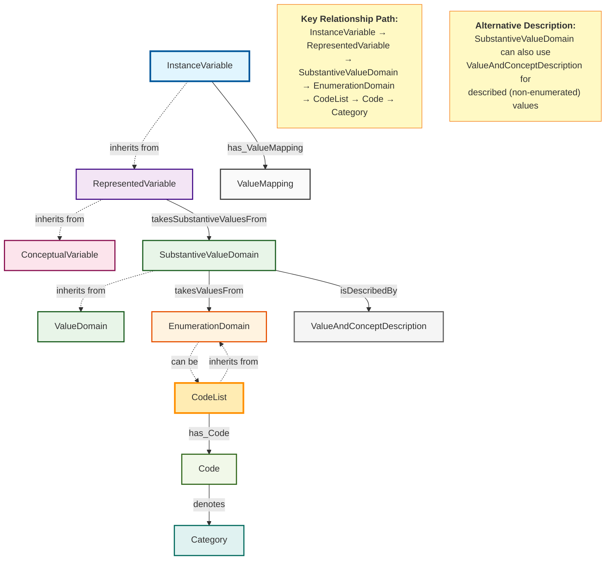

# InstanceVariable and CodeList Relationship Diagram

This diagram shows the relationship between InstanceVariable and CodeList in the DDI-CDI model.

## Relationship Explanation

### Primary Relationship Path

1. **InstanceVariable** (inherits from RepresentedVariable)
   - Represents actual data instances in a dataset
   - Has attributes like `physicalDataType`, `platformType`
   - Can have a `ValueMapping` association

2. **RepresentedVariable** (inherits from ConceptualVariable)
   - Has association `takesSubstantiveValuesFrom` → **SubstantiveValueDomain**
   - Defines how concepts are represented with specific value domains

3. **SubstantiveValueDomain** (inherits from ValueDomain)
   - Has association `takesValuesFrom` → **EnumerationDomain**
   - Can alternatively use `isDescribedBy` → **ValueAndConceptDescription**

4. **EnumerationDomain** (abstract base class)
   - **CodeList** inherits from EnumerationDomain
   - Provides enumerated list of valid values

5. **CodeList** (inherits from EnumerationDomain)
   - Has association `has_Code` → **Code**
   - Contains `allowsDuplicates` boolean attribute
   - Represents structured list of codes and categories

6. **Code**
   - Has association `denotes` → **Category**
   - Represents the alphanumeric symbol used in data
   - Example: "M" for Male, "F" for Female

7. **Category**
   - Represents the concept that the code stands for
   - Example: The concept "Male" or "Female"

### Key Features

- **Inheritance Hierarchy**: InstanceVariable builds upon RepresentedVariable and ConceptualVariable
- **Value Domain Flexibility**: Can use either enumerated values (CodeList) or described values (ValueAndConceptDescription)
- **Code Structure**: Clear separation between codes (symbols) and categories (concepts)
- **Data Mapping**: ValueMapping provides the connection between instance variables and their physical representation

### Example Usage

For a Gender variable:
- **InstanceVariable**: "Gender" with physical data type "string"
- **CodeList**: Gender code list
- **Codes**: "M", "F", "O"
- **Categories**: "Male", "Female", "Other"

This structure allows for standardized representation of categorical data with clear mapping between codes used in datasets and their semantic meaning.
